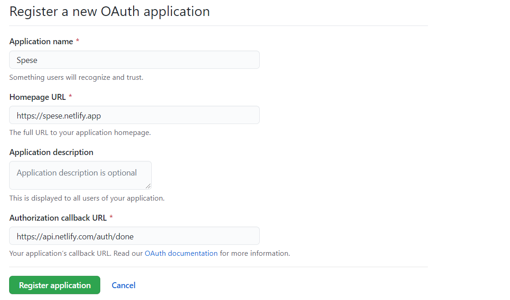
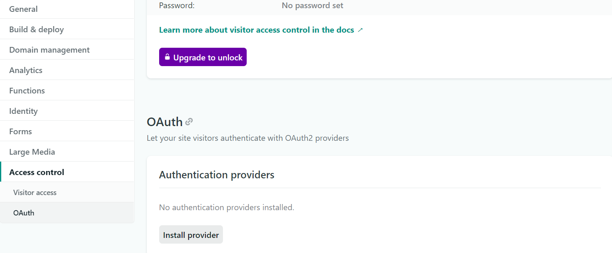
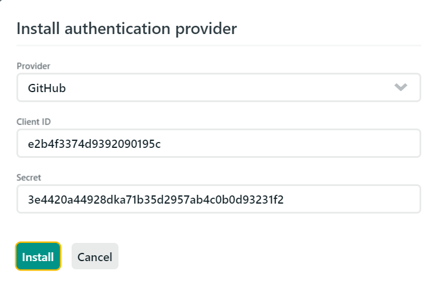
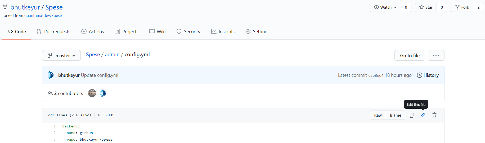

## Configuration

1. Login to your GitHub account.
2. Goto *Account Settings --> Developer Settings --> OAuth Apps --> [New App](https://github.com/settings/applications/new)*.
3. Fill in your application details.
4. For the Authorization callback URL, enter `https://api.netlify.com/auth/done`

    

5. Register  your application by clicking on *Register application* button.
6. When you complete the registration, you'll be given a Client ID and a Client Secret for the app. You'll need to add these to your Netlify site.
7. [Login](https://app.netlify.com?utm_source=Spese) to your account.
8. Select your desired site.
9. From your site dashboard, go to *Settings > Access control > OAuth*.

    

10. Under Authentication Providers, click Install Provider.
11. Select GitHub and enter the Client ID and Client Secret, then Install.

    

12. Goto https://github.com/username/repo/blob/master/admin/config.yml replace username and repo with yours.
13. Click on pencil button to edit the file.

    

14. On 3rd line replace repo with yours in `username/repo` format.
15. Click on *Commit changes* at the end of the page.
16. Wait for a minute and your website is ready to be modified/updated.

## Update/Modify website

You can update and modify website as per your needs by following these steps:

1. Open your website and add */admin* to end of the URL.
2. Login using your same GitHub account which has commit privilege to your website repository.
3. Edit *Settings* as per your needs.
