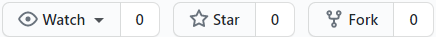
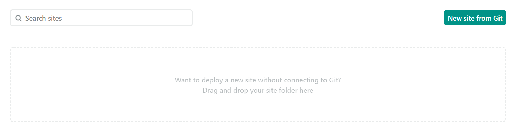
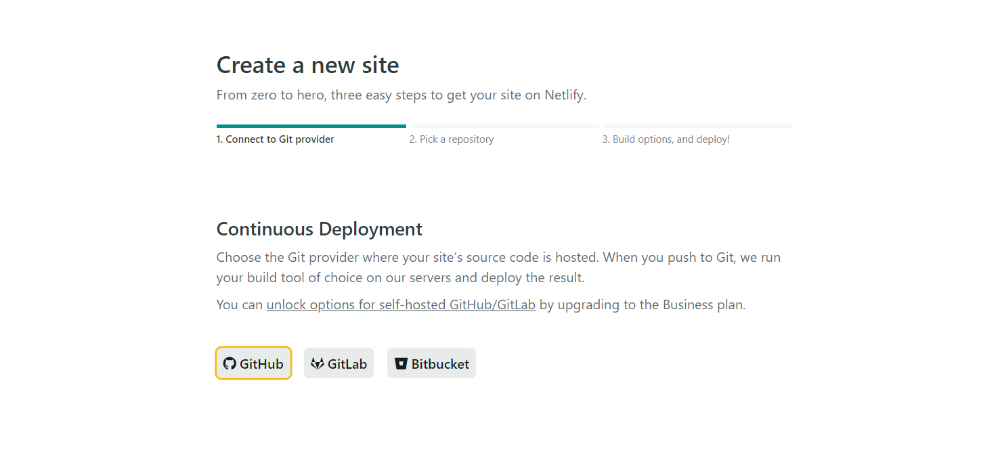
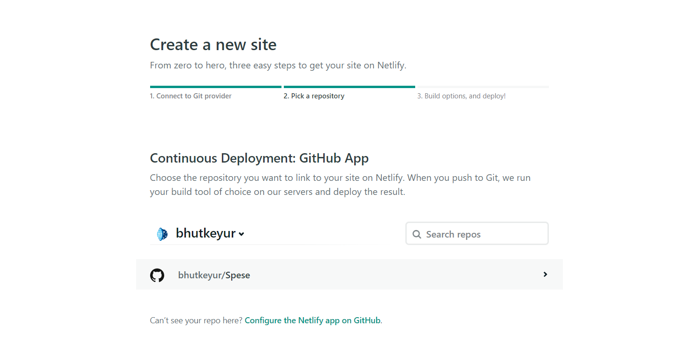
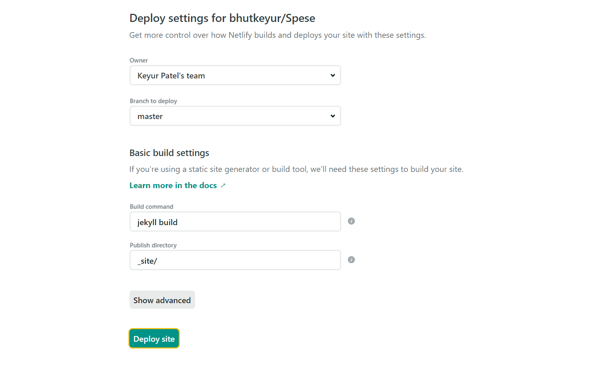
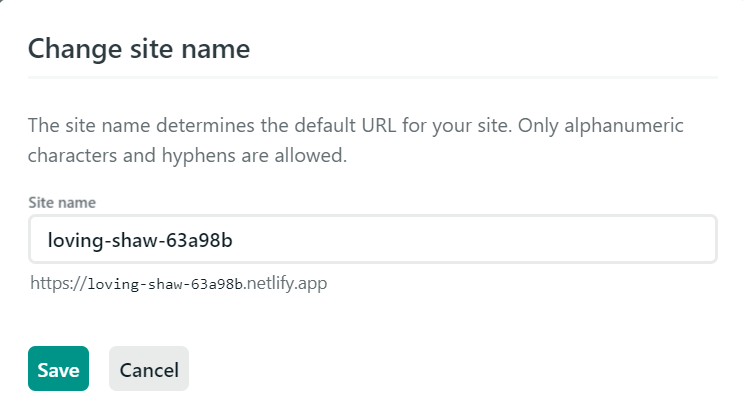

## Deploy

To use The Spese Theme:

1. Fork this repository using the fork button located at top of your right hand.
   
    

2. Create an account on [Netlify](https://www.netlify.com/) or If you already have it, [login](https://app.netlify.com/) to your account.
3. Click on *Create new site from Git* button.

    

4. Click on *Github* to authenticate your account.

    

5. Click on your forked repository.

    

6. Click on deploy site and wait till build completes.

    

7. If you want to rename your site, go to *settings* and change site name.

    

8. Yippee! Your site is deployed.

## Adding Custom Domain

If you want to link custom domain to your site:

1. Login to [Netlify](https://app.netlify.com/) and select your site.
2. Goto *Settings* --> *Domain Management* --> *Add custom domain*.
3. Enter your domain and verify it.

> Note: If you do not have *Project Link* for portfolio then write NULL instead of leaving it blank.